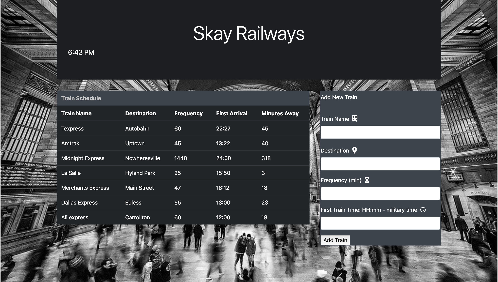

# App Description:
This train schedule application incorporates JavaScript, jQuery, Moment.js, bootstrap and firebase to host arrival and departure data.  This website will provide up-to-date information about various trains, namely their arrival times and how many minutes remain until they arrive at their station.

## link:
 https://skay97.github.io/Train-Scheduler-Firebase/

## Screenshot:
 
